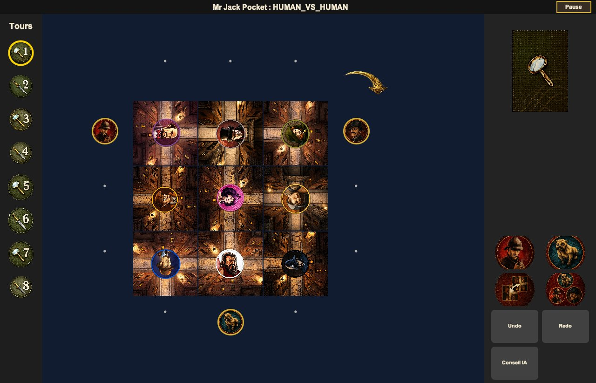
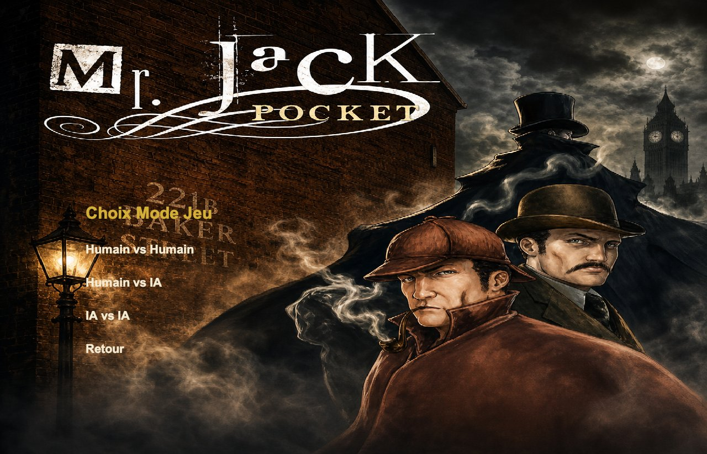

# Mr. Jack Pocket

A computer version of the two-player deduction board game **Mr. Jack Pocket**, written in Java, with an AI opponent built on minimax search with alpha-beta pruning.

One player is **Jack the Ripper**, hiding among nine suspects in Whitechapel. The other is the **investigator**, who moves Holmes, Watson and Toby around the district to see who is visible and narrow down the suspects. Jack wins by staying hidden long enough; the investigator wins by finding him first.



## Features

- **Three game modes:** human vs human, human vs AI (play as Jack or as the investigator), AI vs AI
- **AI opponent** with four difficulty levels, from random play to a 4-ply minimax search
- **AI hint button** ("Conseil IA"): asks the AI for the best move in your position
- **Online multiplayer** over a local network (TCP client/server)
- **Undo / redo**, save and load games (`.sav`)
- Full Swing interface with custom artwork, music and sound effects

## The AI

All the code in [`src/ai`](src/ai) was written by [@BeratMertCibikci](https://github.com/BeratMertCibikci).

| Level | Strategy |
|---|---|
| Easy | Random legal moves |
| Medium | Minimax, depth 1 |
| Hard | Minimax, depth 2 |
| Expert | Minimax, depth 4 |

- **Search:** [`MinimaxAI`](src/ai/MinimaxAI.java) explores the moves of both players with alpha-beta pruning and can play either side. It works on deep copies of the game state, so the real game is never touched while the AI is thinking.
- **Move generation:** [`MoveGenerator`](src/ai/MoveGenerator.java) lists every legal move for the current action token: move a detective, rotate or swap district tiles, draw an alibi card, play the joker.
- **Evaluation:** [`Evaluator`](src/ai/Evaluator.java) scores a position from the number of eliminated suspects, the balance between visible and hidden suspects, and Jack's hourglasses. It respects hidden information: Jack uses his real hourglass count, while the investigator only gets an estimate, because alibi cards are secret.

### Measurements

Benchmarks run with the programs in [`src/main`](src/main) on random starting positions (Apple Silicon laptop, JDK 26).

**Time per move** (30 positions per depth):

| Depth | Median | Max | Nodes visited (avg) |
|---|---|---|---|
| 1 | 0.4 ms | 0.9 ms | 51 |
| 2 | 2.5 ms | 5.1 ms | 355 |
| 4 | 19 ms | 306 ms | 9,301 |

At depth 4, alpha-beta cuts about 3,700 branches per move on average.

**AI vs AI** (40 games per level, both sides at the same level):

| Level | Investigator wins | Jack wins |
|---|---|---|
| Easy | 80% | 20% |
| Medium | 57.5% | 42.5% |
| Hard | 55% | 45% |
| Expert | 65% | 35% |

## Run it

Requires **Java 17 or later**. Run the commands from the repository root: the game loads its images and sounds from `assets/`.

```bash
javac -d out $(find src -name "*.java")
java -cp out IHM.FenetrePrincipale
```

To run the AI benchmarks:

```bash
java -cp out main.AIWinRateTest
java -cp out main.MinimaxBenchmarkTest
```

## Project structure

```
src/
├── model/    Game state: board, tiles, characters, tokens, alibi deck, turns
├── engine/   Rules engine: applies actions, witness phase, end of round, save/load
├── ai/       Minimax with alpha-beta, move generation, evaluation, difficulty levels
├── IHM/      Swing user interface: menus, board, action panels, dialogs
├── reseau/   Network play: game server, client, messages
└── main/     Test and benchmark programs
assets/       Images and sounds
docs/         Class summaries, git workflow, screenshots
```

## Team

Built in 2026 by a team of students at Université Grenoble Alpes, with a Git flow of one feature branch per module (see [`docs/git-workflow.md`](docs/git-workflow.md)).

- [@BeratMertCibikci](https://github.com/BeratMertCibikci): team lead, AI, contributions to the model and the interface
- [@CanErsavass](https://github.com/CanErsavass)
- [@kurtuluk](https://github.com/kurtuluk)
- [@jreyes935](https://github.com/jreyes935)
- [@Mak-Bet](https://github.com/Mak-Bet)
- [@boraseyhan](https://github.com/boraseyhan)

*Mr. Jack Pocket* is a board game by Bruno Cathala and Ludovic Maublanc, published by Hurrican. This is a non-commercial student project.


